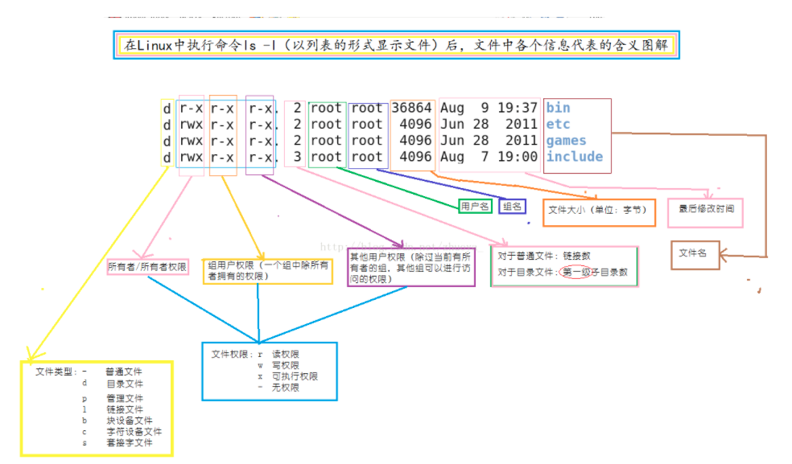

https://www.cnblogs.com/candii/p/11823862.html

1、第一列颜色框：文件类型列，这里简单描述几种常见类型，d表示目录文件，例如dr-xr-xr-x；-表示普通文件，例如-rwxrwxr-x。

2、第二三四列颜色框：文件权限列，因为linux是多用户多任务系统，每个用户对同一个文件的权限可能都不一样，所以对文件的权限设置是非常重要的。

3、第五列颜色框：文件硬链接数或目录子目录数。

如果一个文件不是目录那么这一字段表示：这个文件所具有的硬链接数,即这个文件总共有多少个文件名。

如果是一个目录：则第2字段表示该目录所含子目录的个数，新建一个空目录,这个目录的第二字段就是2,表示该目录下有两个子目录。

为什么新建的目录下面会有两个子目录呢？

因为每一个目录都有一个指向它本身的子目录"." 和指向它上级目录的子目录".."，这两个默认子目录是隐藏的。用ls -a可以看到"."和".."

每次在目录下新建一个子目录，该目录第2字段的值就增1,但是新建一个普通文件该字段值不增加。

4、第六列颜色框：文件所属的拥有者名字

5、第七列颜色框：文件所属组的名字

6、第八列颜色框：文件大小

7、第九列颜色框：文件最后修改时间

8、第十列颜色框：文件名
