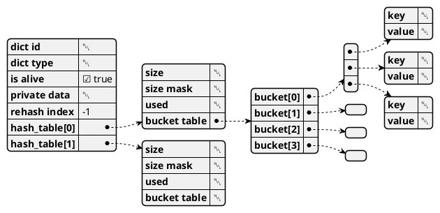

官网:https://redis.io/
中文:https://www.redis.net.cn/


简介
```
Redis支持数据的持久化
Redis能读的速度是110000次/s,写的速度是81000次/s 
Redis的所有操作都是原子性的
Redis在磁盘格式方面他们是紧凑的以追加的方式产生的，因为他们并不需要进行随机访问
```

数据类型
string类型是Redis最基本的数据类型，一个键最大能存储512MB。
hash 可以存储 232 - 1 键值对（40多亿）。
list最多可存储 232 - 1 元素 (4294967295, 每个列表可存储40多亿)。
set中最大的成员数为 232 - 1 (4294967295, 每个集合可存储40多亿个成员)。
zset(sorted set：有序集合),通过分数来为集合中的成员进行从小到大的排序。


### redis-dict

字段:
- bucket
    >为了解决hash冲突，假如hashtable中不同的key通过计算得到同一个index，就会形成单向链表(暂用bucket命名);

- rehash index
  >渐进式扩容
  https://blog.csdn.net/qq_38262266/article/details/107727116
  扩展操作:hash_table[1]扩展的大小是比当前 hash_table[0].used 值的2倍大的第一个 2 的整数幂；
  收缩操作:hash_table[0].used 的第一个大于等于的 2 的整数幂。

- size mask
    >此字段的作用是当使用下标访问数据时，确保下标不越界。
    如当前size为8时，sizemask为7(0x111)。
    当给定一个下标N时，将N与sizemask进行与操作后得出下标才是最终使用的下标，
    这是一个绝对不会越界的下标。
- 查询某个key的 bucket_index
    >int64 hashcode = hashFunction(key);
    int64 bucket_index = hashcode & dict[x].sizemask;

#### 特征
- key遍历无序
- 可能分布不平均/性能不平均


