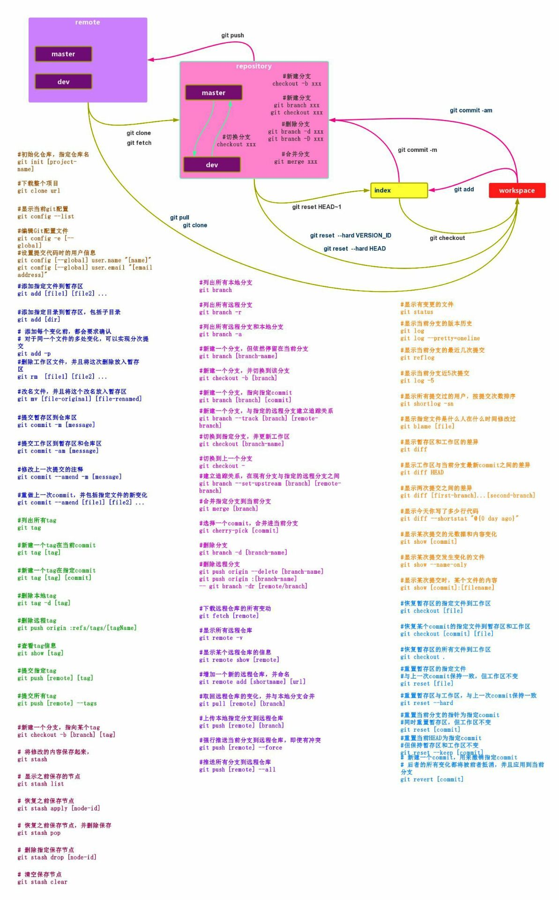

# git

相关链接:
git常用命令整理
https://justcoding.iteye.com/blog/1830388


## git命令



## git更新子模块
	1.添加完子模块之后,在主模块会有一个子模块的commit id, 例如代表提交到了2018-3-1 号的某个commit;

	2.当更换电脑, 重新clone主模块代码时,此时子模块会使用该commit id;

	3.在主模块中进行"初始化-更新子模块"操作,会将子模块代码下载到该commit id的日期(2018-3-1);

	4.如果我们希望使用子模块代码线的最新版本(例如2018-5-1),
	这时候需要进入子模块的目录.然后在里面进行pull操作,然后返回主模块代码线,进入commit,此时才会在主模块中更新子模块的commit id;

	5.下次更换电脑重新clone主模块代码, 再初始化子模块代码时, 就会下载到2018-5-1的代码;
	
## git 更新子模块之后tortosiseGit图标不正常
在子模块目录中，点击一下提交子模块按钮，不用提交，图标就好了：

## 添加子模块

如果失败了.检查下XX\.git\modules下是否有子模块同名目录: 
git submodule add  https://github.com/boostorg/boost.git boost

## 删除子模块
清理完代码线目录后,记得删除D:\liuhex\elune\.git\modules下子模块元数据;


## 手动添加Git bash 到鼠标右键
	步骤：
	1、通过在“运行”中输入‘regedit’，打开注册表。
	2、找到[HKEY_CLASSES_ROOT\Directory\Background]。
	3、在[Background]下如果没有[shell],则右键-新建项[shell]。
	4、在[shell]下右键-新建项[open in Git],其值为“Git Bash Here",此为右键菜单显示名称。
	5、在[Git Bash Here]下右键-新建-字符串值[Icon],双击编辑，其值为“ C:\Program Files (x86)\Git\etc\git.ico”。此为菜单加图标。
	6、在[open in git]下右键-新建-项[command],其值为 ""C:\Program Files (x86)\Git\bin\sh.exe" --login -i"

## GIT中文乱码问题解决
```
http://jingyan.baidu.com/article/72ee561a442746e16138dff8.html

打开git bash, 使用ls命令查看当前目录下的文件，中文显示成乱码。
进入git安装目录。
C:\Program Files (x86)\Git\etc

etc\gitconfig文件中增加以下内容：
[gui]     encoding = utf-8
[i18n]     commitencoding = gbk
[svn]     pathnameencoding = gbk

etc\git-completion.bash文件中增加以下内容：
alias ls='ls --show-control-chars --color=auto'
说明：使得在 Git Bash 中输入 ls 命令，可以正常显示中文文件名。

etc\inputrc文件中增加以下内容：
set output-meta on set convert-meta off
说明：使得在 Git Bash 中可以正常输入中文，比如中文的 commit log。

```

## git删除远程分支
	在Git v1.7.0 之后，可以使用这种语法删除远程分支：
	git push origin --delete <branchName>

	删除tag这么用：
	git push origin --delete tag <tagname>

	否则，可以使用这种语法，推送一个空分支到远程分支，其实就相当于删除远程分支：
	git push origin :<branchName>

	这是删除tag的方法，推送一个空tag到远程tag：
	git tag -d <tagname>
	git push origin :refs/tags/<tagname>
	两种语法作用完全相同。
	
## Git fetch和git pull的区别
	原文： http://www.tech126.com/git-fetch-pull/  
	Git中从远程的分支获取最新的版本到本地有这样2个命令：
	 1. git fetch：相当于是从远程获取最新版本到本地，不会自动merge
	     git fetch origin master
	     git log -p master..origin/master
	     git merge origin/master     以上命令的含义：
	    首先从远程的origin的master主分支下载最新的版本到origin/master分支上
	    然后比较本地的master分支和origin/master分支的差别
	    最后进行合并
	    上述过程其实可以用以下更清晰的方式来进行：
	 git fetch origin master:tmpgit diff tmp git merge tmp     从远程获取最新的版本到本地的test分支上
	    之后再进行比较合并
	 2. git pull：相当于是从远程获取最新版本并merge到本地
	 git pull origin master 上述命令其实相当于git fetch 和 git merge
	 在实际使用中，git fetch更安全一些
	 因为在merge前，我们可以查看更新情况，然后再决定是否合并 
	结束
	
	
## tortoisegit记住密码
	http://www.tuicool.com/articles/VRfiai
	tortoisegit记住密码：我们每次在推送文件的时候总是需要输入用户名和密码，很是麻烦，
	解决方式是打开隐藏文件夹.git下的config文件，在后面加上[credential] helper = store，下次推送的时候就会记住密码了
	
## git 撤销对工作区中文件的修改
	对工作区中文件的修改分为三种情况：
	（1）修改，但没有用Git add将修改添加到暂存区；
	（2）修改，已经使用git add将修改添加到暂存区；
	（3）修改，已经使用git add将修改添加到暂存区，并再次进行修改。
	对于第一种情况，直接使用git checkout -- 文件，即可撤销修改，撤销修改就回到和版本库一模一样的样子。
	第二种情况，先使用git reset HEAD -- 文件，然后在使用git checkout -- 文件进行修改撤销。
	第三种情况 先使用git checkout -- 文件，文件就会变成添加到暂存区后的状态，也就转换成了“第二种情况”，然后，在使用情况（2）中的处理方法，即可将文件恢复到与版本库一致的状态。

	总之，记住一点：“git checkout -- 文件”命令，撤销的是工作中文件的修改，而“git reset HEAD -- 文件”命令，撤销的是暂存区中文件的修改。

	例如,对于目录：
	git checkout -- deps/openssl
	
## win git error init_cheap:VirtualAlloc pointer is null, Win32 error 487
	https://blog.csdn.net/wzhg0508/article/details/46239761
	打开目录：C:\Program Files (x86)\Git\bin
	在该目录下命令行：rebase.exe -b 0x50000000 msys-1.0.dll
	
	
## 在windows系统上使用msysgit / git / tortoisegit，访问git协议的仓库时。git push会卡住没反应。
```
发现按照git push 卡住去google，能搜到不少之前同行发的blog有提到，但貌似没有解决的。这个问题在msysgit的最新版已经解决了，希望这个solution扩散出去。让更多的程序猿同学看到。
=====================
啊啊啊，研究了两天，终于找到solution了。。先仰天长啸一会儿
=====================
项目组使用的server挂掉了，硬盘损毁，svn等好多内容不再可用，恢复无望。
虽然我们的代码之前并未怎么在上面放，但是前车之鉴，这个时候就体现除了git的高大上了。于是准备抛弃之前搭建的svn，搞个git。
在闲置的mac server上使用gitosis搭建，跑起了git daemon。使用ssh-gen来checkin，觉得好方便有木有！！！高大上有木有！！！
直到我在windows里面挂掉了。。。
大概是这样的（从原帖copy的）：
git clone git://xxx.xxx/xxx.git 
然后添加文件，编辑，git add，commit，然后push，结果：

[master 9447645] test
1 file changed, 1 insertion(+)
Counting objects: 20, done.
Compressing objects: 100% (12/12), done.
Writing objects: 100% (18/18)
就此卡住不动，变更也没有push进去。。。。进不去。。。不去。。。去。。。
还以为是自己打开的方式不对，各种重试，重试，重试，换个姿势，重试。。。结果，google吧（顺便鄙视百度，毛也搜不出来），翻遍互联网终于等到你~还好我没放弃。
windows的git工具，甭管是gui还是command tool，统统是基于msysgit的。而msysgit在实现上，有一点儿小瑕疵，查了万千资料，发现这个问题，由于开源的贡献者们太少太忙太不容易，耽误了4年没解决。据说是对什么side-bind-64bit的支持不好导致的。what the hell! 谁晓得那是个啥。。。
搜遍了各种solution，有牛人在server端修改git的binary文件，据说可以糊弄过关。但我不是在linux里面搭建的git server，而是mac；也没在binary文件里面找到那个要修改的string。
最后终于发现开源大牛们给出了一个解决办法（为毛早没发现啊，足足两天啊。。。），在msysgit的最新版本1.9.4里，可以通过一个设置来摆平：
在git的config里面添加：

git config --global sendpack.sideband false
对我来讲，it works fine.
从此git任我行。怎么push怎么酷炫。
妈妈再也不用担心我的server挂掉了。一行代码费了两天牛劲，虽然感觉好像被耍了；但还是觉得挺充实的。
以上。
 
顺便附上这个问题旷日持久的讨论：
https://github.com/msysgit/git/issues/101#
再次感谢开源的大牛们
哦，对了，他们绝大部分看不懂中文： A BIG BIG THANK TO THE GUYS WHO IS WORKING FOR THE OPEN SOURCE PROJECTS!
```


## git diff提示filemode发生改变（old mode 100644、new mode 10075)
```
http://www.cnblogs.com/sunzhenxing19860608/p/6066394.html

今天clone代码，git status显示修改了大量文件，git diff提示filemode变化，如下：
diff --git a/Android.mk b/Android.mk
old mode 100644
new mode 100755
原来是filemode的变化，文件chmod后其文件某些位是改变了的，如果严格的比较原文件和chmod后的文件，两者是有区别的，但是源代码通常只关心文本内容，因此chmod产生的变化应该忽略，所以设置一下：
切到源码的根目录下，
git config --add core.filemode false

这样你的所有的git库都会忽略filemode变更了～
```