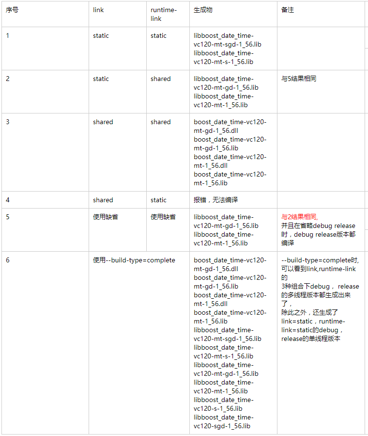

info:
输入命令b2 --help可查看参数的介绍；

#一、编译安装命令
Bjam  [options]  [properties]  [install|stage]
Builds and installs Boost.

install
在“--prefix=”指定的目录下生成所有头文件（boost源代码下boost文件夹下所有文件）和指定库文件；
stage表示只生成库（dll和lib），install还会生成包含头文件的include目录。
本人推荐使用stage，因为install生成的这个include目录实际就是boost安装包解压缩后的boost目录（..\boost_1_64_0\boost，只比include目录多几个非hpp文件，都很小），所以可以直接使用;
而且不同的IDE都可以使用同一套头文件，这样既节省编译时间，也节省硬盘空间。
备注：
install选项时使用prefix, stage选项时使用stagedir;
install 和stage2个选项均未指定的话，默认使用stage选项；

--prefix=<PREFIX>
Install architecture independent files here.
Default; C:/Boost on Win32
Default; /usr/local on Unix. Linux, etc.
表示编译生成文件的路径
eg: --prefix=E:\git\boostlib\deps_boost\prefix


--exec-prefix=<EPREFIX>
Install architecture dependent files here.
安装依赖文件的位置
Default; <PREFIX>
eg: --exec-prefix=E:\git\boostlib\deps_boost\exec-prefix

--libdir=<DIR>
Install library files here.
Default; <EPREFIX>/lib
安装库文件位置；
eg: --libdir=E:\git\boostlib\deps_boost\libdir


--includedir=<HDRDIR>
Install header files here.
Default; <PREFIX>/include
安装头文件位置
该目录内容：..\include\boost-1_64\boost
eg: --includedir=E:\git\boostlib\deps_boost\includedir


stage
Build and install only compiled library files to the stage directory.
在“--stagedir=”指定的目录下生成指定库文件
只编译安装库文件，不安装头文件，这个选项和install选项二选一；


--stagedir=<STAGEDIR>
Install library files here
Default; ./stage
存放编译后库文件的路径，默认是stage
eg: --stagedir=E:\git\boostlib\deps_boost\stage


####Other Options:
--build-type=<type>
Build the specified pre-defined set of variations of the libraries.
Note, that which variants get built depends on what each library supports.
    minimal:(default)
        Builds a minimal set of variants.
        On Windows, these are static multithreaded libraries in debug and release modes, using shared runtime.
        On Linux,   these are static and shared multithreaded libraries in release mode.
    complete
        Build all possible variations.
eg: --build-type=complete
--build-type=complete 表示编译所有版本，不然只会编译一小部分版本（相当于:variant=release,threading=multi;link=shared|static;runtime-link=shared）


--build-dir=DIR
Build in this location instead of building within the distribution tree. Recommended!
编译的临时文件会放在builddir里(编译完就可以把它删除了)
该目录内容：
..build-dir\boost\architecture
..build-dir\boost\bin.v2
默认就在根目录（E:\SDK\boost）下，目录名为bin.v2，等编译完成后可将这个目录全部删除；
eg: --build-dir=E:\git\boostlib\deps_boost\build-dir


--show-libraries
Display the list of Boost libraries that require build and installation steps, and then exit.
译文：显示需要构建和安装步骤的Boost库列表，然后退出


--layout=<layout>
Determine whether to choose library names and header locations such that multiple versions of Boost or multiple compilers can be used on the same system.
The default value is 'versioned' on Windows, and 'system' on Unix.
    versioned:
    Names of boost binaries include the Boost version number, name and version of the compiler and encoded build properties.
    Boost headers are installed in a subdirectory of <HDRDIR> whose name contains the Boost version number.

    tagged
    Names of boost binaries include the encoded build properties such as variant and threading,
    but do not including compiler name and version, or Boost version.
    This option is useful if you build several variants of Boost,using the same compiler.

    system
    Binaries names do not include the Boost version number or the name and version number of the compiler.
    Boost headers are installed directly into <HDRDIR>.
    This option is intended for system integrators building distribution packages.


--buildid=ID
Add the specified ID to the name of built libraries.
The default is to not add anything.

--python-buildid=ID
Add the specified ID to the name of built libraries that depend on Python.
The default is to not add anything.
This ID is added in addition to --buildid.

--help
This message.
帮助文档


--with-<library>
Build and install the specified <library>.
If this option is used, only libraries specified using this option will be built.
只编译指定的库；
eg: --with-regex 表示只编译regex库了


--without-<library>
Do not build, stage, or install the specified <library>.
By default, all libraries are built.
指定无需编译的库，默认的话全部编译；
因为Python、mpi等库我都用不着，所以排除之。
还有wave、graph、math、regex、test、program_options、serialization、signals这几个库编出的静态lib都非常大，所以不需要的也可以without掉。
这可以根据各人需要进行选择，默认是全部编译。
但是需要注意，如果选择编译python的话，是需要python语言支持的，应该到python官方主页http://www.python.org/下载安装。
eg: --without-regex 表示不编译regex库


##### Properties
toolset=toolset
Indicates the toolset to build with.
指定编译器，可选的如borland、gcc、msvc（VC6）、msvc-9.0（VS2008）等。
    msvc-6.0 :  VC6.0
    msvc-7.0:  VS2003
    msvc-8.0:  VS2005
    msvc-9.0:  VS2008
    msvc-10.0:  VS2010


variant=debug|release
Select the build variant
决定编译什么版本(Debug or Release)
eg: variant=debug|release

link=static|shared
Whether to build static or shared libraries
生成静态链接库还是动态链接库
刘浩备注：缺省值是static

threading=single|multi
Whether to build single or multithreaded binaries
决定使用单线程还是多线程库

runtime-link=static|shared
Whether to link to static or shared C and C++ runtime.
决定是静态还是动态链接C/C++运行时库。同样有shared和static两种方式；
刘浩备注：缺省值是shared


# 二、其他命令
```
b2 [options] [properties] [targets]
  Options, properties and targets can be specified in any order.

# Important Options:
  * --clean Remove targets instead of building
  * -a Rebuild everything
  * -n Don't execute the commands, only print them
  * -d+2 Show commands as they are executed
  * -d0 Suppress all informational messages
  * -q Stop at first error
  * --reconfigure Rerun all configuration checks
  * --debug-configuration Diagnose configuration
  * --debug-building Report which targets are built with what properties
  * --debug-generator Diagnose generator search/execution

Further Help:
  The following options can be used to obtain additional documentation.
  * --help-options Print more obscure command line options.
  * --help-internal Boost.Build implementation details.
  * --help-doc-options Implementation details doc formatting.
```


#三、编译选项备注：
1、编译选项组合：
编译选项 有4个(variant 、link 、threading 、runtime)，理论上应该有 2*2*2*2 = 16 种配置，


实际使用的多为多线程， 所以 threading= multi， 这样剩下的3个选项组成的编译配置就是下面所罗列的：
其中静态链接C++标准库的boost动态库这种配置也不存在， 所以就只有6种情况。
threading=mult variant=debug runtime-link=shared link=static //生成debug版本，多线程，动态链接c++标准库的boost静态库
threading=mult variant=debug runtime-link=static link=static //生成debug版本，多线程，静态链接c++标准库的boost静态库
threading=mult variant=debug runtime-link=shared link=shared //生成debug版本，多线程，动态链接c++标准库的boost动态库
//threading=mult variant=debug runtime-link=static link=shared//生成debug版本，多线程，静态链接c++标准库的boost动态库（无效--输出:没有这种配置）

threading=mult variant=release runtime-link=shared link=static //生成release版本，多线程，动态链接c++标准库的boost静态库
threading=mult variant=release runtime-link=static link=static //生成release版本，多线程，静态链接c++标准库的boost静态库
threading=mult variant=release runtime-link=shared link=shared//生成release版本，多线程，动态链接c++标准库的boost动态库
//threading=mult variant=release runtime-link=static link=shared//生成release版本，多线程，静态链接c++标准库的boost动态库（无效--输出:没有这种配置）


2、库文件后缀：
link= static ： 静态库。 生成的库文件名称以 “lib”开头
link= shared ： 动态库。生成的库文件名称无“lib”开头

threading= mult : 支持多线程。 生成的库文件名称中包含 “-mt”

variant=release  生成的库文件名称不包含 “-gd”
variant= debug  生成的库文件名称包含 “-gd”

runtime-link= static  生成的库文件名称包含 “-s”
runtime-link= shared  生成的库文件名称不包含 “-s”


3、link, runtime-link结果：


序号linkruntime-link生成物备注
1staticstatic
libboost_date_time-vc120-mt-sgd-1_56.lib
libboost_date_time-vc120-mt-s-1_56.lib　

2staticshared
libboost_date_time-vc120-mt-gd-1_56.lib
libboost_date_time-vc120-mt-1_56.lib与5结果相同
3sharedshared
boost_date_time-vc120-mt-gd-1_56.dll
boost_date_time-vc120-mt-gd-1_56.lib
boost_date_time-vc120-mt-1_56.dll
boost_date_time-vc120-mt-1_56.lib　
4sharedstatic报错，无法编译　
5使用缺省使用缺省
libboost_date_time-vc120-mt-gd-1_56.lib
libboost_date_time-vc120-mt-1_56.lib
与2结果相同,
并且在省略debug release时，debug release版本都编译

6使用--build-type=complete
boost_date_time-vc120-mt-gd-1_56.dll
boost_date_time-vc120-mt-gd-1_56.lib
boost_date_time-vc120-mt-1_56.dll
boost_date_time-vc120-mt-1_56.lib
libboost_date_time-vc120-mt-sgd-1_56.lib
libboost_date_time-vc120-mt-s-1_56.lib
libboost_date_time-vc120-mt-gd-1_56.lib
libboost_date_time-vc120-mt-1_56.lib
libboost_date_time-vc120-s-1_56.lib
libboost_date_time-vc120-sgd-1_56.lib
--build-type=complete时,可以看到link,runtime-link的
3种组合下debug， release的多线程版本都生成出来了，
除此之外，还生成了link=static，runtime-link=static的debug， release的单线程版本


从上面的结果可以看到，link和runtime-link的缺省配置是 link=static runtime-link=shared；


