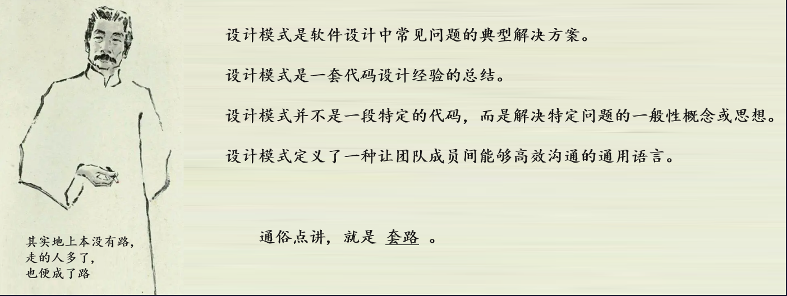
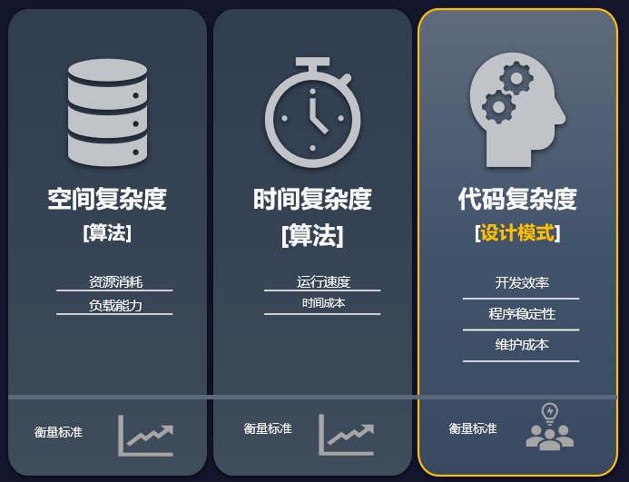

[toc]

# 设计模式是什么?



# 设计模式可以解决什么问题?
### 程序复杂性的3个维度

- 时间复杂度
    >影响运行速度
- 空间复杂度
    >影响资源消耗
- 代码复杂度
    >影响开发效率
    
## 关于美学:


**合理的使用设计模式,可以巧妙的降低代码复杂度;**

# 代码是怎么变复杂的?

代码复杂性的形成原因:
- 需求的易变性
- 资源的有限性
- 需求的多样性
- ...

# 代码复杂性的表现形式?
```plantuml

package 依赖 {
    object "A" as A
    object "B" as B
    A ..> B


    package 实现 {
        object "A" as I
        object "B" as J
        I ..^ J
        
        package 继承 {
            object "A" as K
            object "B" as L
            K --^ L
        }
    }
    
    package 关联 {
        object "A" as C
        object "B" as D
        C --> D
        
        package 聚合 {
            object "A" as E
            object "B" as F
            E o--> F
            
            package 组合 {
                object "A" as G
                object "B" as H
                G *-- H
            }
        }
    }

}

```
• 依赖：对类 B 进行修改会影响到类 A 。 
• 关联：对象 A 知道对象 B。类 A 依赖于类 B。 
• 聚合：对象 A 知道对象 B 且由 B 构成。类 A 依赖于类 B。
• 组合：对象 A 知道对象 B、由 B 构成而且管理着 B 的生命周 期。类 A 依赖于类 B。 
• 实现：类 A 定义的方法由接口 B 声明。对象 A 可被视为对象 B。类 A 依赖于类 B。 
• 继承：类 A 继承类 B 的接口和实现， 但是可以对其进行扩 展。对象 A 可被视为对象 B。类 A 依赖于类 B。


# 比设计模式更重要的是?
```plantuml
!include %getenv("C4_HEADER")\c4_header.puml

Person(程序员,程序员, "")
System(设计模式, "设计模式", "[ARGSS]\n[GoF]\n[Actor]\n[MVC]\n[IOC]\n[Producer-Consumer]\n[...]")
Container(设计原则, "设计原则", "[]", "[SOLID]\n[GRASP]\n[DRY]\n[YAGNI]\n[Three rules]\n[SOC]\n[...]")
Container(编程范式, "编程范式", "OOP", "[对象]: 数据 行为 抽象\n [特性]:  封装 继承 多态\n[关系]: 依赖 聚合 组合\n[...]: ...")
Component(设计思想, "设计思想", "玄学")

Rel(程序员, 设计模式, "复用一些模式")en
Rel(程序员, 编程范式, " ")
Rel(设计模式, 编程范式, "利用一些语言特性")
Rel(设计模式, 设计原则, "满足一些设计原则")
Rel(编程范式, 设计思想, " ")
Rel(设计原则, 设计思想, " ")
```
比模式更重要的是:原则!
- 设计模式能指导你如何使用一些设计原则来解决各种问题


# 一些设计原则

## SOLID原则
####  单一职责原则
(Single Responsibility Principle - SRP)
一个类只有一个引起变化的原因。
如果一个类有多个引起变化的原因，当其中一个变化时会影响到其他代码。这样代码的内聚性不好，会导致维护性变差，复用性降低。
用于指导对类的设计，只有一个引起变化的原因，单一职责，设计出高内聚的类（或方法等元素）。

#### 开放封闭原则
(Open Close Principle)
对扩展开放，对修改关闭。在程序需要进行拓展的时候，不能去修改原有的代码，实现一个热插拔的效果。
简言之，是为了使程序的扩展性好，易于维护和升级。想要达到这样的效果，我们需要使用接口和抽象类。

#### 里氏代换原则
(Liskov Substitution Principle)
里氏代换原则是面向对象设计的基本原则之一。
里氏代换原则中说，任何基类可以出现的地方，子类一定可以出现。
LSP 是继承复用的基石，只有当派生类可以替换掉基类，且软件单位的功能不受到影响时，基类才能真正被复用，而派生类也能够在基类的基础上增加新的行为。
里氏代换原则是对开闭原则的补充。实现开闭原则的关键步骤就是抽象化，而基类与子类的继承关系就是抽象化的具体实现，所以里氏代换原则是对实现抽象化的具体步骤的规范。

#### 接口隔离原则
(Interface Segregation Principle)
这个原则的意思是：使用多个隔离的接口，比使用单个接口要好。
它还有另外一个意思是：降低类之间的耦合度。
由此可见，其实设计模式就是从大型软件架构出发、便于升级和维护的软件设计思想，它强调降低依赖，降低耦合。


#### 依赖倒转原则
(Dependence Inversion Principle)
这个原则是开闭原则的基础，具体内容：针对对接口编程，依赖于抽象而不依赖于具体。
```plantuml
class 上层类
class 下层类A
class 下层类B
上层类 --> 下层类A
上层类 --> 下层类B
```

```plantuml
class 上层类
class 下层类A
class 下层类B
interface 抽象接口

上层类 -r-> 抽象接口
抽象接口 ^.. 下层类A
抽象接口 ^.. 下层类B
```

## GRASP原则
https://www.cnblogs.com/itfly8/p/14035074.html
https://blog.csdn.net/wfeii/article/details/80183718
https://blog.csdn.net/u013249965/article/details/51779634

## 代码抽象原则
#### DRY原则（Don't repeat yourself）
意思是：不要重复自己。它的涵义是，系统的每一个功能都应该有唯一的实现。也就是说，如果多次遇到相同的问题，就需要抽象出一个通用的解决方案，不要重复开发相同的功能。

用代码举例：如果两个地方需要发送短信的功能，第一个功能是发送提醒短信，第二个是发送验证码短信。则需要把发送短信的公用代码进行提炼。

#### YAGNI原则（ You aren't gonna need it）
意思是：你不会需要它。出自极限编程的原则，指除了核心功能外，其它功能一概不要部署。背后的指导思想是尽快的让代码运行起来。简单理解是尽量避免不必要的代码，少就是多。比如：过多的日志打印，过多逻辑检查，过多的异常处理等，如果能简化则简化。

####  Rule Of Three原则
Rule of three 称为"三次原则"，指的是当某个功能第三次出现时，才进行"抽象化"。它的含义是：当第一次用到某个功能时，写一个特定的解决方法；第二次又用到的时候，拷贝上一次的代码；第三次出现的时候，才着手"抽象化"，写出通用的解决方法。

三原则之间的关系
DRY强调对通用问题的抽象，
YAGNI强调快速和简单。
Rule Of Three相当于对前两个原则做了一个折衷，提出了应用原则的度量。
三原则的折中，有以下几个好处。
（1）省事，避免过度设计：如果只有一个地方用，就没必要过度抽象，避免过度设计。
（2）容易发现模式：问题出现的场景多，容易找到通用的部分，方便进行抽象，进而找到模式。


## 其他原则
#### 最少知识原则
(Least Knowledge Principle - LKP)
最少知识原则又叫迪米特法则(Demeter Principle)。
一个实体应当尽量少的与其他实体之间发生相互作用，使得系统功能模块相对独立。也就是说一个软件实体应当尽可能少的与其他实体发生相互作用。当一个模块修改时，尽量少的影响其他的模块，容易扩展，这是对软件实体之间通信的限制，要求限制软件实体之间通信的宽度和深度。

#### SOC原则
Separation of Concerns - SOC) 将一个复杂的问题分离为多个简单的问题,然后逐个解决这些简单的问题,那么这个复杂的问题就解决了

#### 合成复用原则 
(Composite Reuse Principle)也有翻译为:组合复用原则,聚合复用原则
合成复用原则是指：尽量使用合成/聚合的方式，而不是使用继承。
组合/聚合复用原则（Composition/Aggregation Reuse Principle - CARP）
在设计中，优先考虑使用组合，而不是继承。继承容易产生副作用，组合具有更好的灵活性。如：代理模式、装饰模式、适配器模式等。

#### 4.2 无环依赖原则（Acyclic Dependencies Principle - ADP）

当 A 模块依赖于 B 模块，B 模块依赖于 C 模块，C 依赖于 A 模块，此时将出现循环依赖。
在设计中应该避免这个问题，可通过引入“中介者模式”解决该问题。

#### 4.3 共同封装原则（Common Closure Principle - CCP）
将易变的类放在同一个包里，将变化隔离出来。该原则是“开放-封闭原则”的延伸。

#### 4.4 共同重用原则（Common Reuse Principle - CRP）
如果重用了包中的一个类，那么也就相当于重用了包中的所有类，我们要尽可能减小包的大小。

#### 4.5 好莱坞原则（Hollywood Principle - HP）
好莱坞明星的经纪人一般都很忙，他们不想被打扰，往往会说：Don't call me, I'll call you. 
翻译为：不要联系我，我会联系你。对应于软件设计而言，最著名的就是“控制反转”（或称为“依赖注入”），
我们不需要在代码中主动的创建对象，而是由容器帮我们来创建并管理这些对象。

#### 4.6 保持它简单与傻瓜（Keep it simple and stupid - KISS）
不要让系统变得复杂，界面简洁，功能实用，操作方便，要让它足够的简单，足够的傻瓜。

#### 4.7 惯例优于配置（Convention over Configuration - COC）
尽量让惯例来减少配置，这样才能提高开发效率，尽量做到“零配置”。很多开发框架都是这样做的。

#### 4.8 命令查询分离（Command Query Separation - CQS）
在定义接口时，要做到哪些是命令，哪些是查询，要将它们分离，而不要揉到一起。在读写分离或分布式系统中应用较多。

#### 4.9 关注点分离（Separation of Concerns - SOC）
将一个复杂的问题分解为多个简单的问题，然后逐个解决简单的问题，那么复杂的问题就解决了。

#### 4.10 契约式设计（Design by Contract - DBC）
模块或系统之间的交互，都是基于契约（接口或抽象）的，而不要依赖于具体实现。该原则建议我们要面向契约编程。


# GOF设计模式
https://refactoringguru.cn/design-patterns

## Interpreter
略
Why don't the book include the Interpreter pattern?
http://blogs.perl.org/users/jeffrey_kegler/2013/03/the-interpreter-design-pattern.html


# 关于actor模式


# 一些编码技巧
## 关于延迟调用
快递
快递员
物流公司

## 关于生命周期
演员
延迟进场
提前退出


# 参考资料:
- C++设计模式
    http://www.weixueyuan.net/cpp/shejimoshi/

- 面试中的Singleton 
    http://www.cnblogs.com/loveis715/archive/2012/07/18/2598409.html#!comments

- 设计模式大全:
    https://www.cnblogs.com/stringarray/p/12793282.html
