# cppreference搬运

## C++编译器支持
[C++ 编译器支持情况表](https://zh.cppreference.com/w/cpp/compiler_support)

## C++ 语言
[C++语言参考手册](https://zh.cppreference.com/w/cpp/language)

## C++ 标准库头文件
[C++标准库头文件](https://zh.cppreference.com/w/cpp/header)
```c++
//工具库
    //工具
    #include <cstdlib> //通用工具：程序控制、动态内存分配、随机数、排序与查找 
    #include <csignal> //信号管理的函数与宏常量
    #include <csetjmp> //保存到执行环境的宏，及跳到执行环境的函数 
    #include <cstdarg> //变长参数列表的处理 
    #include <typeinfo> //运行时类型信息工具 
    #include <typeindex> (C++11 起) //std::type_index
    #include <type_traits> (C++11 起) //编译时类型信息 
    #include <bitset> //std::bitset 类模板 
    #include <functional> //函数对象、函数调用、绑定操作、引用包装 
    #include <utility> //多种工具组件 
    #include <ctime> //C 风格时间/日期工具 
    #include <chrono> (C++11 起) //C++ 时间工具 
    #include <cstddef> //标准宏和类型定义 
    #include <initializer_list> (C++11 起) //std::initializer_list 类模板 
    #include <tuple> (C++11 起) //std::tuple 类模板 
    #include <any> (C++17 起) //std::any 类 
    #include <optional> (C++17 起) //std::optional 类模板 
    #include <variant> (C++17 起) //std::variant 类模板 
    #include <compare> (C++20 起) //三路比较运算符支持 
    #include <version> (C++20 起) //提供依赖实现的库信息 

    //动态内存管理 
    #include <new> //低层内存管理工具 
    #include <memory> //高层内存管理工具 
    #include <scoped_allocator> (C++11 起) //嵌套分配器类 
    #include <memory_resource> (C++17 起) //多态分配器及内存资源 
    
    //数值极限 
    #include <climits> //整数类型极限 
    #include <cfloat> //浮点类型极限 
    #include <cstdint> (C++11 起) //定长整数及其他类型的极限 
    #include <cinttypes> (C++11 起) //格式化宏、 intmax_t 及 uintmax_t 数学工具及转换 
    #include <limits>//查询算术类型属性的标准化方式 

    //错误处理
    #include <exception> //异常处理工具 
    #include <stdexcept> //标准异常对象 
    #include <cassert> //将其参数与零比较的条件性编译宏 
    #include <system_error> (C++11 起) //定义std::error_code，平台依赖的错误码 
    #include <cerrno> //含有最近一次错误号的宏 

//字符串库
#include <cctype> //确定字符数据中所含类型的函数 
#include <cwctype> //确定宽字符数据中所含类型的函数 
#include <cstring> //多种窄字符串处理函数 
#include <cwchar> //多种宽及多字节字符串处理函数 
#include <cuchar> (C++11 起) //C 风格 Unicode 字符转换函数 
#include <string> //std::basic_string 类模板 
#include <string_view> (C++17 起) //std::basic_string_view 类模板 
#include <charconv> (C++17 起) //std::to_chars 与 std::from_chars 

//容器库
#include <array> (C++11 起) //std::array 容器 
#include <vector> //std::vector 容器 
#include <deque> //std::deque 容器 
#include <list> //std::list 容器 
#include <forward_list> (C++11 起) //std::forward_list 容器 
#include <set> //std::set 及 std::multiset 关联容器 
#include <map> //std::map 及 std::multimap 关联容器 
#include <unordered_set> (C++11 起) //std::unordered_set 及 std::unordered_multiset 无序关联容器 
#include <unordered_map> (C++11 起) //std::unordered_map 及 std::unordered_multimap 无序关联容器 
#include <stack> //std::stack 容器适配器 
#include <queue> //std::queue 及 std::priority_queue 容器适配器 
#include <span> (C++20 起) //std::span 视图 

//迭代器库
#include <iterator> //容器迭代器 

//算法库
#include <algorithm> //操作于容器上的算法 
#include <execution> (C++17) //算法并行版本的预定义执行策略 

//数值库
#include <cmath> //常用数学函数 
#include <complex> //复数类型 
#include <valarray> //表示和操作值的数组的类 
#include <random> (C++11 起) //随机数生成器及分布 
#include <numeric> //容器中值的数值运算 
#include <ratio> (C++11 起) //编译时有理数算术 
#include <cfenv> (C++11 起) //浮点环境访问函数 

//输入/输出库
#include <iosfwd> //所有输入/输出库中的类的前置声明 
#include <ios> //std::ios_base 类、std::basic_ios 类模板及数个 typedef 
#include <istream> //std::basic_istream 类模板及数个 typedef 
#include <ostream> //std::basic_ostream 、 std::basic_iostream 类模板及数个typedef 
#include <iostream> //数个标准流对象 
#include <fstream> //std::basic_fstream 、 std::basic_ifstream 、 std::basic_ofstream 类模板及数个typedef 
#include <sstream> //std::basic_stringstream 、 std::basic_istringstream 、 std::basic_ostringstream 类模板及数个 typedef 
#include <syncstream> (C++20 起) //std::basic_osyncstream 、 std::basic_syncbuf 及 typedef 
#include <strstream> (弃用) //std::strstream 、 std::istrstream 、 std::ostrstream 
#include <iomanip> //控制输入输出格式的帮助函数 
#include <streambuf> //std::basic_streambuf 类模板 
#include <cstdio> //C 风格输入输出函数 

//本地化库
#include <locale> //本地化工具 
#include <clocale> //C 本地化工具 
#include <codecvt> (C++11 起)(C++17 中弃用) //Unicode 转换设施 

//正则表达式库
#include <regex> (C++11 起) //支持正则表达式处理的类、算法及迭代器 

//原子操作库
#include <atomic> (C++11 起) //原子操作库 

//线程支持库
#include <thread> (C++11 起) //std::thread 类及支持函数 
#include <mutex> (C++11 起) //互斥原语 
#include <shared_mutex> (C++14 起) //共享的互斥原语 
#include <future> (C++11 起) //异步计算的原语 
#include <condition_variable> (C++11 起) //线程等待条件 

//文件系统库
#include <filesystem> (C++17 起) //std::path 类及支持函数 
```

 

## C++标准库概览
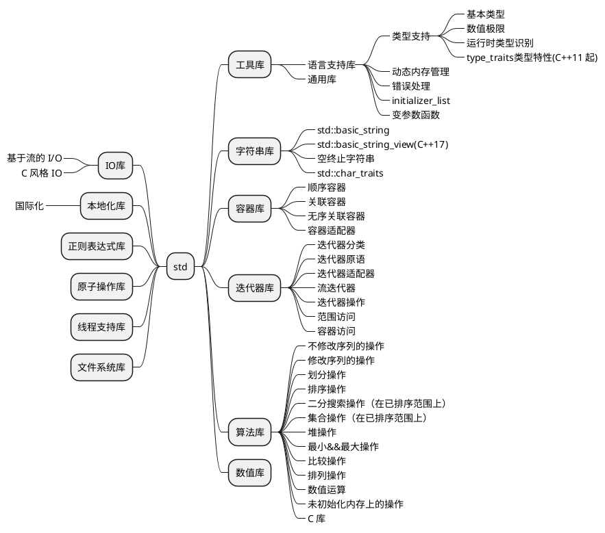

***
### /工具库/语言支持库/类型支持/基本类型

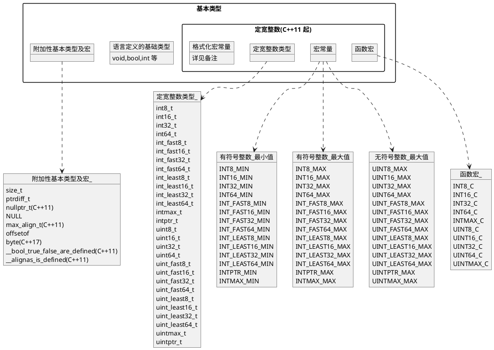
###### 备注:
定宽整数/格式化宏常量:
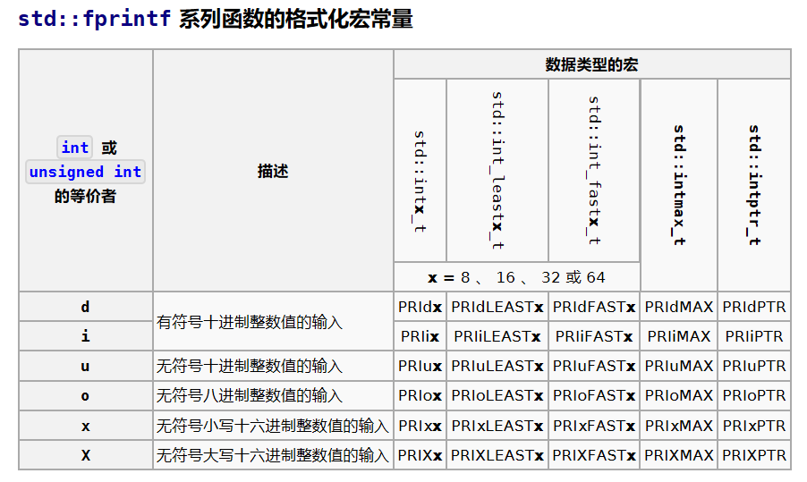
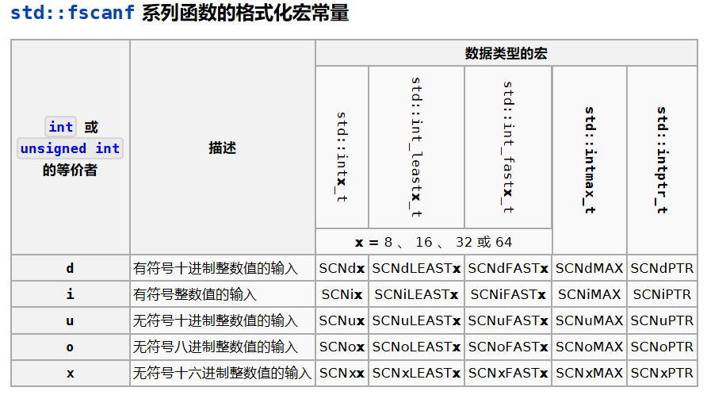

***
### /工具库/语言支持库/类型支持/数值极限

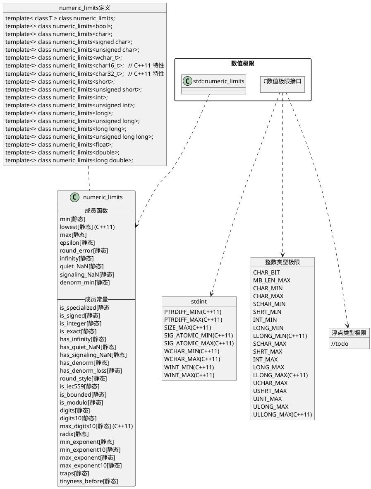
###### 备注:
numeric_limits与C库宏常量的关系
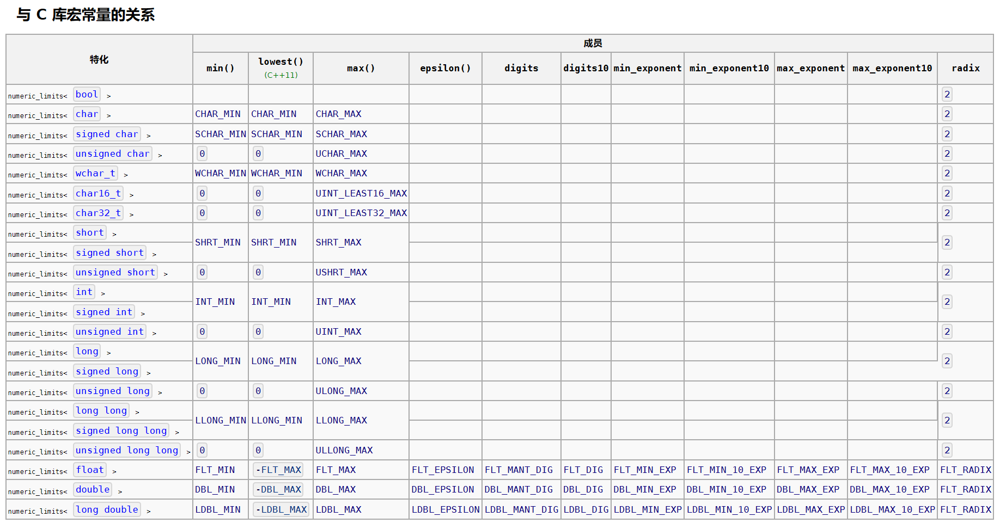


***
### /工具库/语言支持库/类型支持/运行时类型识别

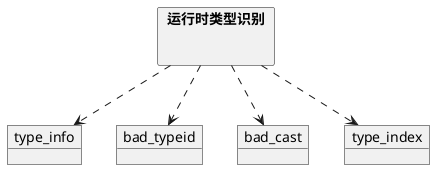

***
### /工具库/语言支持库/类型支持/type_traits类型特性(C++11 起)

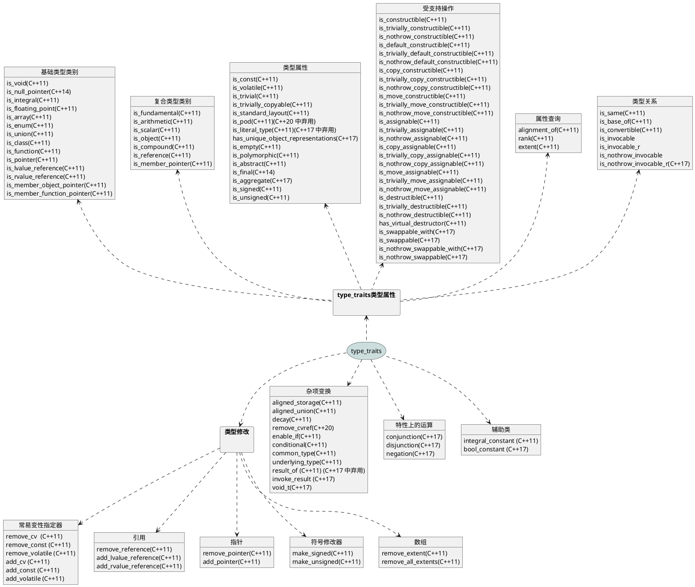


***
### /工具库/语言支持库/动态内存管理

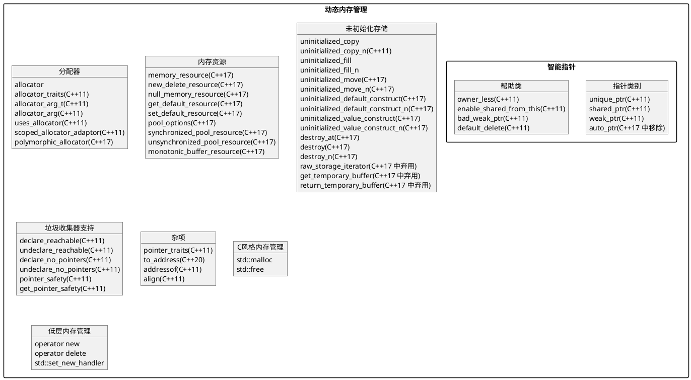


***
### /工具库/语言支持库/错误处理
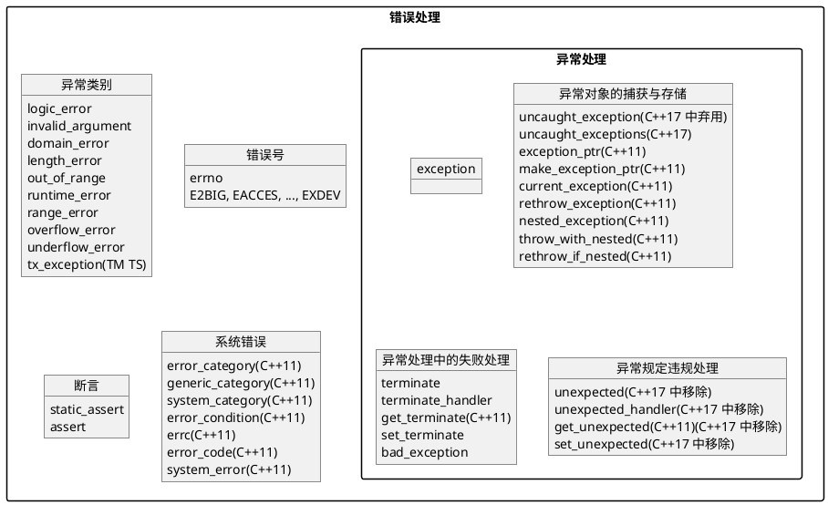

***
### /工具库/语言支持库/initializer_list
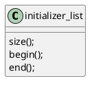

***
### /工具库/语言支持库/变参数函数
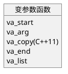

***
### /工具库/通用库
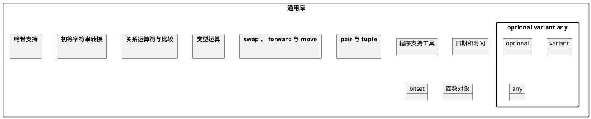

***
### /字符串库
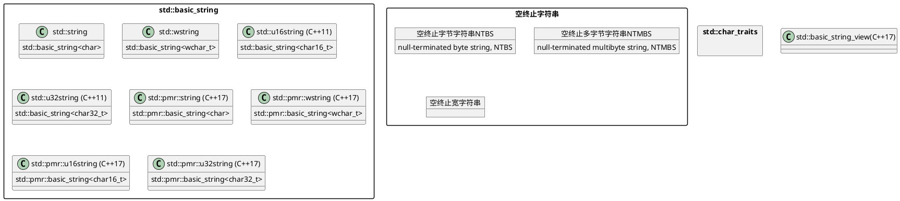


***
### /容器库
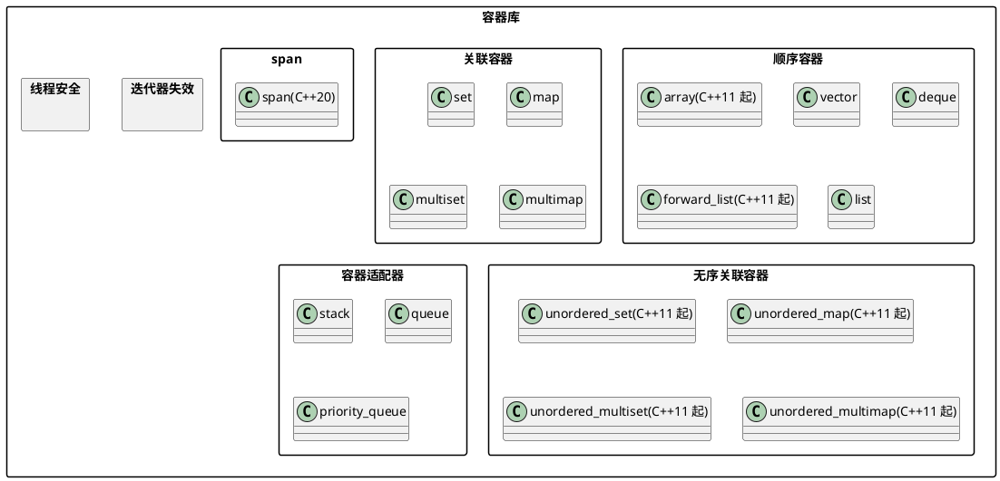

###### 备注:
迭代器失效:


***
### /迭代器库
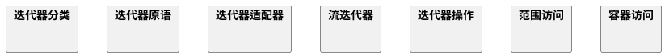
###### 备注:
迭代器分类:<br>


***
### /算法库
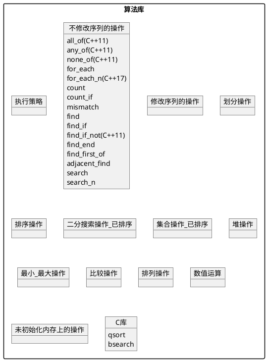

***
### /数值库
```plantuml
@startuml
skinparam packageStyle rect


@enduml
```

***
### /IO库
```plantuml
@startuml
skinparam packageStyle rect


@enduml
```
###### 备注:
IO类图:<br>


***
### /本地化库
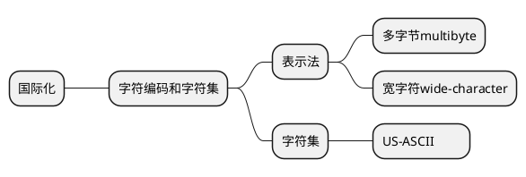


***
### /正则表达式库
```plantuml
@startuml
skinparam packageStyle rect


@enduml
```


***
### /原子操作库
```plantuml
@startuml
skinparam packageStyle rect


@enduml
```


***
### /线程支持库
```plantuml
@startuml
skinparam packageStyle rect


@enduml
```


***
### /文件系统库
```plantuml
@startuml
skinparam packageStyle rect


@enduml
```